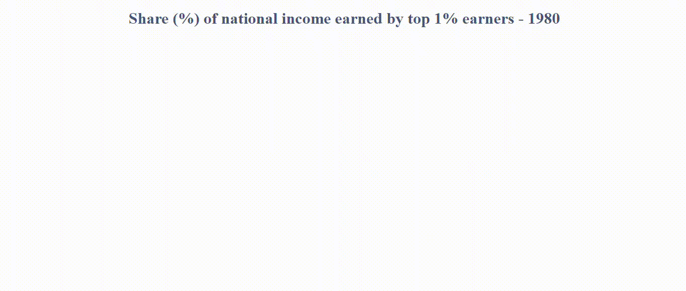

# income_inequality

## Content

Interactive map of income inequality (represented by share of top 1%) by country and year

## data source

[Word Inequality Database](https://wid.world/fr/monde/#sptinc_p99p100_z/US;FR;DE;CN;ZA;GB;WO/last/eu/k/p/yearly/s/false/5.64/30/curve/false/country)

